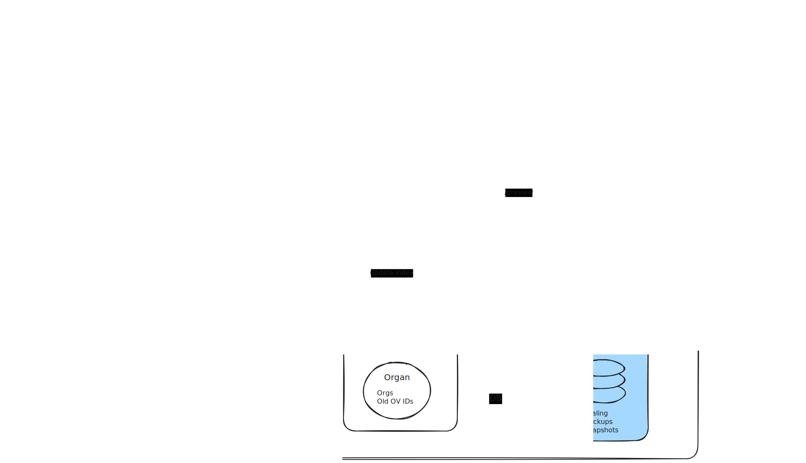

# Architecture

This section provides a high-level overview of the architecture of the Open Vault application, including its components and how they interact with each other.

For installation instructions, see the [Quickstart Tutorial](../tutorials/quickstart.md).

