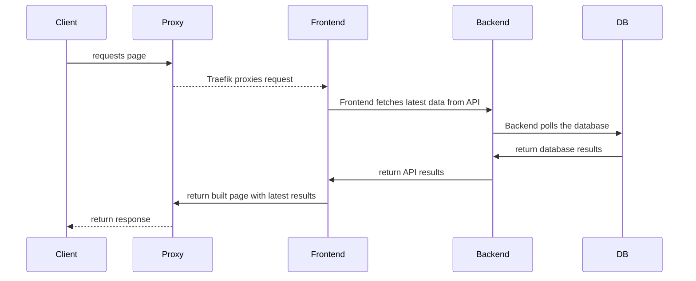

# About the Stack

Open Vault is deployed as a number of separate services, built as docker images with GitHub Actions, deployed in a [kubernetes](#kubernetes) cluster, and managed by [Argo-CD](#argo-cd).

## Kubernetes

Production deployments are run in a Kubernetes cluster, using images built by our CI/CD pipeline. 

Deployment `yaml`s are stored in this repository in subfolders by service.

### Resources
Each component of the stack is deployed as a set of Kubernetes resources. They consist of:

#### Node
: A `node` is a physical or virtual machine that the cluster is running on. The cluster is made up of a number of nodes, which are managed by the cluster.

#### Image

: An `image` is a docker container containing all the code needed to run a single service.

#### Pod
: A `pod` is the smallest unit of deployment in Kubernetes. It is a single running container (Docker image), which is managed by a deployment. They are designed to be ephemeral, and easily scaled up or down.

#### Deployment
: A `deployment` is a set of pods (the running containers). The deployment manages the pods, and ensures that the desired number of pods are running at all times.

#### Service
: A `service` is a network endpoint that can be accessed by other pods. It is used to expose a deployment as a named endpoint, which can be accessed by other pods in the cluster, e.g: `http://ov-wag/`.

#### Ingress
: An `ingress` is a network endpoint that can be accessed by external clients. It is used to expose a service as a named endpoint, which can be accessed by clients outside the cluster.

!!! kube "Traefik"
    We use [Traefik](https://traefik.io/solutions/kubernetes-ingress/) as our ingress controller, which is configured to route incoming requests to the appropriate service. It also handles SSL termination, redirects HTTP requests to HTTPS, and allows for custom routing rules.

#### ConfigMap
: A `configmap` is a set of key-value pairs that can be accessed by pods. It is used to store configuration values that are needed by the pods.

#### Secret
: A `secret` is a secure set of key-value pairs that can be accessed by pods. It is used to store sensitive configuration values that are needed by the pods.

#### Namespace

: A `namespace` is a group of resources that are deployed together. Namespaces are used to separate different deployments, like production and demo.

!!! kube "Namespacess"

    Currently, we deploy two namespaces:

    - `ov` Production
    - `ov-demo` Demo

## Argo-CD
[Argo-CD](https://argo-cd.readthedocs.io/en/stable/) is a declarative, GitOps continuous delivery tool for Kubernetes. 

It is configured to watch for changes in the `main` branch of this repository, and automatically deploy changes to the cluster.

### Deployments
Argo-CD is configured to deploy the following deployments:

#### ov-wag
: The backend service, running the Wagtail CMS and API.

#### ov-frontend
: The frontend service, running the Remix server.

#### postgres
: A non-production database service, running PostgreSQL.

!!! example "Production Database"
    The production database is managed by AWS RDS, and is not deployed by Argo-CD.

!!! info "Multiple Deployments"
    A deployment can be deployed multiple times to the same cluster, in different namespaces, with different configurations (e.g. different branches)
    
    The two primary deployments go to the `ov` and `ov-demo` namespaces, but more could be added without affecting these.

## Terms 
The following are some definitions for some of the terms used in this guide:

### Production
: The fully deployed stack, publicly available to all clients

 : [Deployment](deploy.md) is orchestrated through `kubernetes`.

### Demo / Staging

: A separate production stack, used to test changes and maintain a live working backup.

: This will be available on a different domain than the production stack, running in a separate namespcae.

### CI
: Continuous Integration. The process of automatically building and testing code changes. 

!!! github "GitHub Actions"
    This is done with GitHub Actions workflows defined in the `.github/workflows` folder of the `ov-wag` and `ov-frontend` repositories.

    Builds are performed automatically on every push to the `main` branch, and on every pull request, tagged with `pr-<number>`.

    Builds are performed regardless of tests passing or failing.

### CD

: Continuous Deployment. The process of automatically deploying code changes to the production environment.

!!! kube "Argo-CD"
    Deployments are managed by [Argo-CD](https://argoproj.github.io/argo-cd/), which is configured to watch for changes in the  `main` branch. When a change is detected, Argo-CD will pull the latest configuration from the repository, compare it against the running system, and if necessary, apply changes to the cluster.

### Frontend

: [Remix](https://remix.run/) server delivering the HTML + Javascript code to the user. 

Source: [github.com/WGBH-MLA/ov-frontend/](https://github.com/WGBH-MLA/ov-frontend/)

Docker: [ghcr.io/wgbh-mla/ov-frontend](https://github.com/WGBH-MLA/ov-frontend/pkgs/container/ov-frontend)

### Backend

: [Wagtail](https://wagtail.org/) (Django) Headless CMS for admin content creation and management, and API to serve the frontend with content.

Source: [github.com/WGBH-MLA/ov-wag](https://github.com/WGBH-MLA/ov-wag)

Docker: [ghcr.io/wgbh-mla/ov-wag](https://github.com/WGBH-MLA/ov-frontend/pkgs/container/ov-wag)

### DB

: Database. Using [PostgreSQL](https://www.postgresql.org/)

```yml title="Database image"
  image: postgres:16-alpine
```
### Proxy

: [Traefik](https://traefik.io/solutions/kubernetes-ingress/) Reverse Proxy. Handles routing of incoming requests to the appropriate service. Also handles SSL termination, redirects HTTP requests to HTTPS, and allows for custom routing rules.


## Call sequence

The following diagram describes the call sequence for incoming requests:


