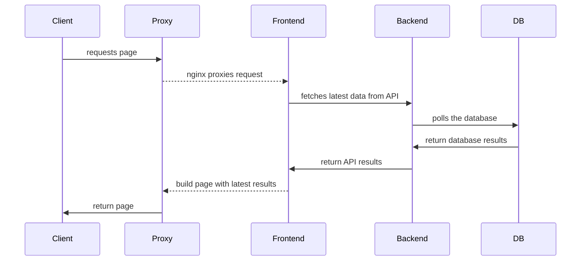

# Stack

Open Vault is deployed as a number of seperate services, built into `docker` images.

[Development](/dev) is done with `docker compose`

[Deployment](/deploy) is orchestrated through `kubernetes`, using `Rancher`.

???+ abstract "Microservices vs macro application"

    While it is possible to run all services combined on a single physical or virtual instance, it is **strongly** recommended to run as a series of micro-services, which can be versioned and scaled independently.

    All documentation here will describe deployment through `docker` and `kubernetes`.

## Images

These are the pre-built docker images to deploy various microservices:

### `ov-frontend`

Javascript frontend, built with [remix](https://remix.run/)

Source: [github.com/WGBH-MLA/ov-frontend/](https://github.com/WGBH-MLA/ov-frontend/)

Docker: [wgbhmla/ov-frontend](https://hub.docker.com/r/wgbhmla/ov-frontend)

### `ov-wag`

Python backend and API, built with [wagtail](https://wagtail.org/)

Source: [github.com/WGBH-MLA/ov-wag](https://github.com/WGBH-MLA/ov-wag)

Docker: [wgbhmla/ov-wag](https://hub.docker.com/r/wgbhmla/ov-wag)

### `db`

Database. Built with [PostgreSQL](https://www.postgresql.org/)

```yml
image: postgres:14.2-alpine
```

### `ov-nginx`

Proxy image, using [nginx](https://www.nginx.com/)

```yml
image: ov-nginx:v0.1.0
```

### `jumpbox`

Utility kit, based on [ubuntu](https://ubuntu.com/) with command line helpers such as:

- `curl`
- `postgres`
- `python`

## Call sequence

When a new request comes in:


