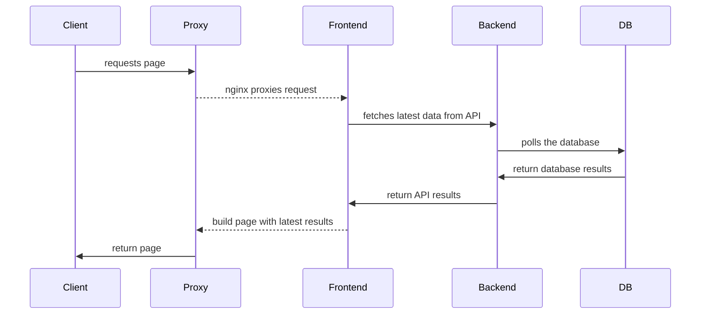

# About the Stack

Open Vault is deployed as a number of separate services, built and deployed in a `kubernetes` cluster.

## Kubernetes

Production deployments are run in a Kubernetes cluster, using images built by our CI/CD pipeline. 

Deployment `yaml`s are stored in this repository in subfolders by service.

Deployments are managed by [Argo-CD](https://argoproj.github.io/argo-cd/), which is configured to watch for changes in the  `main` branch. When a change is detected, Argo-CD will pull the latest configuration from the repository, and apply it to the cluster.

### Resources
Each component of the stack is deployed as a set of Kubernetes resources. They consist of:

### Image

: A docker container containing all the code needed to run a single service.

#### Pod
: A pod is the smallest unit of deployment in Kubernetes. It is a single running container (Docker image), which is managed by a deployment. They are designed to be ephemeral, and easily scaled up or down.

#### Deployment
: A deployment is a set of pods (the running containers). The deployment manages the pods, and ensures that the desired number of pods are running at all times.

#### Service
: A service is a network endpoint that can be accessed by other pods. It is used to expose a deployment as a named endpoint, which can be accessed by other pods in the cluster.

#### Ingress
: An ingress is a network endpoint that can be accessed by external clients. It is used to expose a service as a named endpoint, which can be accessed by clients outside the cluster.

!!! kube "Traefik"
    We use [Traefik](https://traefik.io/solutions/kubernetes-ingress/) as our ingress controller, which is configured to route incoming requests to the appropriate service. It also handles SSL termination, redirects HTTP requests to HTTPS, and allows for custom routing rules.

#### ConfigMap
: A config map is a set of key-value pairs that can be accessed by pods. It is used to store configuration values that are needed by the pods.

#### Secret
: A secret is a secure set of key-value pairs that can be accessed by pods. It is used to store sensitive configuration values that are needed by the pods.

### Namespace

: A group of resources that are deployed together. Namespaces are used to separate different deployments, like production and demo.

!!! note "Namespacess"

    Currently, we are deploying two namespaces:

    - `ov` - Production
    - `ov-demo` - Demo

## Terms 
The following are some definitions for some of the terms used below:

### Production
: The fully deployed stack, publicly available to all clients

 : [Deployment](deploy.md) is orchestrated through `kubernetes`.

### Demo / Staging

: A separate production stack, used to test changes and maintain a live working backup.

: This will be available on a different domain than the production stack, running in a separate namespcae.

### Frontend

: [Remix](https://remix.run/) server delivering the HTML + Javascript code to the user. 

Source: [github.com/WGBH-MLA/ov-frontend/](https://github.com/WGBH-MLA/ov-frontend/)

Docker: [ghcr.io/wgbh-mla/ov-frontend](https://github.com/WGBH-MLA/ov-frontend/pkgs/container/ov-frontend)

### Backend

: [Wagtail](https://wagtail.org/) (Django) Headless CMS for admin content creation and management, and API to serve the frontend with content.

Source: [github.com/WGBH-MLA/ov-wag](https://github.com/WGBH-MLA/ov-wag)

Docker: [ghcr.io/wgbh-mla/ov-wag](https://github.com/WGBH-MLA/ov-frontend/pkgs/container/ov-wag)

### `db`

: Database. Built with [PostgreSQL](https://www.postgresql.org/)

```yml
image: postgres:16-alpine
```

## Call sequence

The following diagram describes the call sequence for incoming requests:


