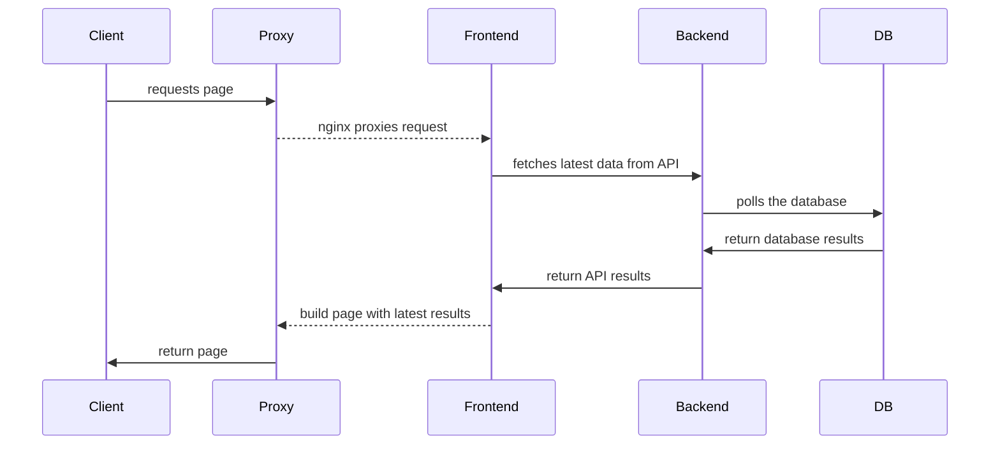

# About the Stack

Open Vault is deployed as a number of separate services, built into `docker` images.

## Concepts

The following are some definitions for some of the terms used below:

### Production
: The fully deployed stack, publicly available to all clients

 : [Deployment](deploy.md) is orchestrated through `kubernetes`.

### Demo / Staging

: A separate production stack, used to test changes and maintain a live working backup.

: This will be available on a different domain than the production stack, running in a separate namespcae.

### Image

: A docker container containing all the code needed to run a single service.

### Pod

: A single instance of a running docker image. Pods are managed by `kubernetes` deployments, and designed to be ephemeral, and easily scaled up or down.

### Namespace

: The name of the Kubernetes context. This keeps resources separate from other deployments.

!!! note "Valid namespaces"

    Currently, this must be one of:

    - `ov` - Production
    - `ov-demo` - Demo

## Services

These are the pre-built docker images to deploy various microservices:

### `ov-frontend`

Javascript frontend, built with [remix](https://remix.run/)

Source: [github.com/WGBH-MLA/ov-frontend/](https://github.com/WGBH-MLA/ov-frontend/)

Docker: [ghcr.io/wgbh-mla/ov-frontend](https://github.com/WGBH-MLA/ov-frontend/pkgs/container/ov-frontend)

### `ov-wag`

Python backend and API, built with [wagtail](https://wagtail.org/)

Source: [github.com/WGBH-MLA/ov-wag](https://github.com/WGBH-MLA/ov-wag)

Docker: [ghcr.io/wgbh-mla/ov-wag](https://github.com/WGBH-MLA/ov-frontend/pkgs/container/ov-wag)

### `db`

Database. Built with [PostgreSQL](https://www.postgresql.org/)

```yml
image: postgres:16-alpine
```

## Call sequence

The following diagram describes the call sequence for incoming requests:


